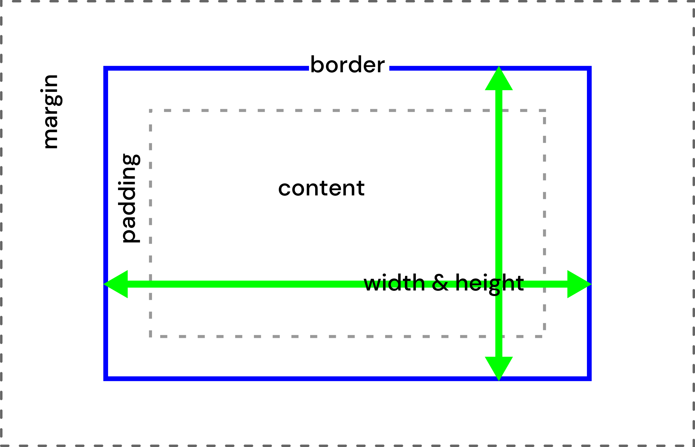

## Welcome to **Design for the Web 2**

_DES491 - Fall 2025_

Let's make some Web Sites!

---

## Today in Class

- Review CSS Selectors Homework
- CSS units
  - Color units
  - Measurement units
- Shorthand Properties
- CSS Properties
  - Typography
  - The Box Model
  - Layout

---

# Let's Review the Homework

---

# CSS Properties

---

## How many CSS properties are there?

---

## A lot. (~500)

---

Luckily, we don't need to memorize all of them.

We will use about 30 of them for most things.

---

# Types of CSS Properties

## Color

## Measurement

---

# Color in CSS

We have a few different ways to describe color in CSS:

```css[1-11|1-2|4-5|7-8|10-11]
/* Named Colors */
color: blue;

/* Hex Codes */
color: #0000ff;

/* RGB Colors */
color: rgb(0, 0, 255);

/* HSL Colors */
color: hsl(240, 100%, 50%);
```

<strong style="color:#0000ff">This text is blue.</strong>

---

## Transparent Colors in CSS

CSS also supports colors with transparency (_alpha channel_).

```css[1-9|1-2|4-5|7-8]
/* Hex Code with Alpha */
color: #0000ff80;

/* RGBA Colors */
color: rgba(0, 0, 255, 0.5);

/* HSLA Colors */
color: hsla(240, 100%, 50%, 0.5);
```

<strong style="color:#0000ff80">This text is blue with some transparency.</strong>

---

## Measurement in CSS

CSS supports a variety of types of measurements:

---

## Absolute Measurements

Absolute measurements are constant - they _do not change_ with the window size.

`px` : Pixels

We also can technically use print-based units (though there's no guarantee they are accurate!)

- `in` : Inches
- `cm` : Centimeters
- `mm` : Millimeters

---

## Relative Measurements

Most of the time, we want to use _relative measurements,_ which are able to adapt to the size of the viewport or the parent element. This will allow us to create layouts that smoothly adapt to different screen sizes.

---

## Percentage

`%` : Percentage: _relative to another element_

The percentage will be based on the size of another element (usually but not always the parent element).

- usually based on the parent element's width/height
- _for padding/margin:_ always based on the parent element's **width**
- _for font-size:_ based on the parent element's **font size**

---

## Viewport Units

`vw`, `vh` : Viewport Width / Height

- `vw` is 1% of the viewport width
- `vh` is 1% of the viewport height

These can be very practical for creating elements that take up a specific portion of the viewport - such as a banner that takes up the full page width

---

# Type-based Units: `em`, `rem`, and `ch`

---

## `em` unit

`em` : Relative to the font-size of an element.

This can be useful for applying the same styling across multiple elements that use different font sizes

```text
h3,h4,h5 {
  padding: 0.25em;
  border-radius: 0.25em;
}
```

<h3 style="display:inline-block;padding:0.25em;border-radius:0.25em;background-color:lightblue">This is an h3</h3>
<h4 style="display:inline-block;padding:0.25em;border-radius:0.25em;background-color:lightblue">This is an h4</h4>
<h5 style="display:inline-block;padding:0.25em;border-radius:0.25em;background-color:lightblue">This is an h5</h5>

---

## `rem` unit

`rem`: Relative to the font-size of the _root_ element (the `html` element that contains the whole page)

This means that 1rem is usually equal to your base font size (usually around 16px). This makes `rem` a good unit for general layout and spacing.

---

## `ch` unit

`ch` : Relative to the width of the "0" (zero) character in the element's font

This is most often used for setting maximum widths for text blocks that are loosely based on character counts

---

## Review:

What is the difference between `em` and `rem`?

---

- `em` is relative to the font-size of the element
- `rem` is relative to the font-size of the root element

---

## Review:

What is the difference between absolute and relative measurement units?
What is an example of each type?

---

- Absolute units do not change with the window size (e.g. `px`)
- Relative units adapt to the window size or parent element (e.g. `%`, `em`, `rem`, `vw`, `vh`)

---

# Shorthand Properties

---

For some CSS properties, we can set multiple related properties at once using a shorthand property.

```css
margin-top: 10px;
margin-right: 20px;
margin-bottom: 10px;
margin-left: 20px;
```

can be written as:

```css
margin: 10px 20px;
```

We use this most often for `margin` and `padding`, but there are others as well. We will look at the specific shorthand properties as we go.

---

### `margin` and `padding` shorthand

```css
/* one value: all sides the same */
padding: 1rem;

/* two values: vertical horizontal */
margin: 1rem 2rem;

/* three values: top horizontal bottom */
margin: 10px 20px 30px;

/* four values: top right bottom left */
margin: 10px 20px 30px 40px;
```

---

# CSS Properties: Typography

Most of the type properties (other than `color`) start with the word `font-` or `text-`.

---

### `color`

Defines the **text color**.

```css
p {
  color: red;
}
```

---

### `font-family`

Sets the **typeface**, using a list of fonts (_font stack_). The first available font is used.

```css
p {
  font-family: "DM Sans", Helvetica, Arial, sans-serif;
}
```

Always include fallback fonts. You can include common system fonts, such as `Helvetica` or `"Times New Roman"`

The last option should always be a generic font family:

`serif`
`sans-serif`
`monospace`
`cursive`
`fantasy`

---

### `font-size`

Controls the **size of text**.

```css
p {
  font-size: 1.25rem;
}
```

---

### `font-style` & `font-weight`

- `font-style`: italic or normal
- `font-weight`: thickness (100-900, or `regular`/`bold`)

```css
p {
  font-style: italic;
  font-weight: bold;
}
```

---

### `line-height`

Controls **space between lines**. Equivalent to 'leading' in print.

```css
p {
  line-height: 1.5;
}
```

This property is set as a plain number (multiplier of font size).

---

### `text-align`

Aligns text **left, right, center, justify**.

```css
p {
  text-align: center;
}
```

---

### `text-decoration`

Adds **decorations** such as underline, overline, line-through (strikethrough).

```css
a {
  text-decoration: underline;
}
```

Options: `none`, `underline`, `line-through`, `overline`.

---

### Advanced `text-decoration`

```css
a {
  text-decoration: underline;
  text-decoration-color: red;
  text-decoration-style: dashed;
  text-decoration-thickness: 2px;
}
```

or shorthand:

```css
a {
  text-decoration: underline red dashed 2px;
}
```

We can also control color, style, and thickness of text decoration.

https://developer.mozilla.org/en-US/docs/Web/CSS/text-decoration

We also have `text-underline-offset` to control the distance between text and underline.

---

### `letter-spacing` & `word-spacing`

- `letter-spacing`: space between characters
- `word-spacing`: space between words

```css
p {
  letter-spacing: 2px;
  word-spacing: 8px;
}
```

---

### `text-transform`

Changes the **case** of text.

```css
p {
  text-transform: uppercase;
}
```

Options: `uppercase`, `lowercase`, `capitalize`.

---

### `text-transform` and Accessibility

If it is necessary to have text in all uppercase, it is best to do this with `text-transform:uppercase` rather than typing the text in all uppercase. This is because screen readers will often read all-caps text as an acronym, letter by letter.

In general, avoid using all-caps text for larger blocks of text, as it can be difficult to read. Our eyes rely on the shapes of words to help read quickly, and all-caps text removes these shapes (as all letters are the same height).

---

# The CSS Box Model

The Box Model describes how elements are rendered on the page, and how we can control their size and spacing.

**Note:** there are two slightly different box models in CSS. We will be using the `border-box` model, which is considered modern best practice. This means that you will need the following CSS in your project:

```css
* {
  box-sizing: border-box;
}
```

---



- **Content:** the space taken up by the actual content (text, image, child elements)
- **Padding:** the space between the content and the border
- **Border:** the line around the element (visible or invisible). If an element has a background, the background color will extend to the border.
- **Margin:** the space outside the border, in which no other elements will be placed

---

# Size and Spacing Properties

---

### `width` & `height`

Set the size of an element's containing box (content + padding + border).

```css
div {
  width: 200px;
  height: 100px;
}
```

<div style="border: 2px solid black; width: 200px; height: 100px;margin:0 auto;"></div>

---

### `max-width` & `min-width`, `max-height` & `min-height`

Constrain element sizing.

```css
img {
  max-width: 100%;
  min-width: 150px;
}
```

We can use this in combination with relative units to create flexible layouts.

---

### `padding`

Empty space **inside** the element, between content and border.

```css
div {
  padding: 20px;
}
```

---

### `margin`

Space **outside** the element, between border and other elements.

```css
div {
  margin: 10px;
}
```

Can be used to control spacing between elements.

---

### `border`

Draws a line around the element.

```css
div {
  border: 2px solid black;
}
```

This is a shorthand property:

`border: <width> <style> <color>;`

https://developer.mozilla.org/en-US/docs/Web/CSS/border

---

### `border-***`

We can also control each side of the border individually:

```css
div {
  border-top: 4px dashed red;
  border-right: 2px solid black;
  border-bottom: 6px dotted green;
}
```

<div style="border-top: 4px dashed red; border-right: 2px solid black; border-bottom: 6px dotted green;; width: 200px; height: 100px;margin:0 auto;"></div>

---

### `border-radius`

Rounds the corners of a box.

```css
div {
  border-radius: 1rem;
}
```

<div style="border: 2px solid black; border-radius: 1rem; width: 200px; height: 100px;margin:0 auto;"></div>

---

### `background-color`

Sets the background color of an element.

```css
div {
  background-color: lightblue;
}
```

<div style="border: 2px solid black; background-color: lightblue; width: 200px; height: 100px;margin:0 auto;"></div>

---

# Layout/Position

---

## `display`

Controls how an _element and/or its children_ are displayed.

```css
div {
  display: flex;
}
```

Options: `block`, `inline`, `inline-block`, `flex`, `grid`, `none`.

---

## `block` layout

In block layout, child elements take up the full width of the container, stacking vertically. This is the default for _most_ elements.

```css
div.child {
  display: block;
}
```

<div class="container" style="border: 2px solid black; padding: 10px; width: 300px; margin:0 auto;">
  <div style="background-color:lightblue; margin:5px; padding:5px;height:50px">Child 1</div>
  <div style="background-color:lightgreen; margin:5px; padding:5px;height:50px">Child 2</div>
  <div style="background-color:lightcoral; margin:5px; padding:5px;height:50px">Child 3</div>

---

## `inline` layout

In inline layout, child elements take up only as much width as they need, and flow like text (left to right for an English page).

```css
div.child {
  display: inline;
}
```

<div class="container" style="border: 2px solid black; padding: 10px; width: 300px; margin:0 auto;box-sizing:border-box;">
  <div style="background-color:lightblue; margin:5px; padding:5px;height:50px;display:inline">Child 1</div>
  <div style="background-color:lightgreen; margin:5px; padding:5px;height:50px;display:inline">Child 2</div>
  <div style="background-color:lightcoral; margin:5px; padding:5px;height:50px;display:inline">Child 3</div>
</div>

Note: Inline elements are weird with sizing and padding/margin - you can see the elements are overlapping.

---

Inline elements can also wrap to the next line if they run out of space:

<div class="container" style="border: 2px solid black; padding: 10px; width: 300px; margin:0 auto;box-sizing:border-box;">
  <div style="background-color:lightblue; margin:5px; padding:5px;height:50px;display:inline">Child 1</div>
  <div style="background-color:lightgreen; margin:5px; padding:5px;height:50px;display:inline">Child 2 with a longer amount of text</div>
  <div style="background-color:lightcoral; margin:5px; padding:5px;height:50px;display:inline">Child 3</div>
</div>

---

## `inline-block` layout

Inline-block elements behave like a combination of block and inline elements. They flow like inline elements, but you can set width/height/padding/margin like block elements.

```css
div.child {
  display: inline-block;
}
```

<div class="container" style="border: 2px solid black; padding: 10px; width: 300px; margin:0 auto;box-sizing:border-box;">
  <div style="background-color:lightblue; margin:5px; padding:5px;height:50px;display:inline-block">Child 1</div>
  <div style="background-color:lightgreen; margin:5px; padding:5px;height:50px;display:inline-block">Child 2</div>
  <div style="background-color:lightcoral; margin:5px; padding:5px;height:50px;display:inline-block">Child 3</div>
</div>

---

## `display:none

`display: none` completely removes an element from the layout. It will not take up any space on the page. It will also not be visible to screen readers!
We would usually use this for hidden elements that we want to show later, such as a pop-up menu.

```css
div {
  display: none;
}
```

---

## `grid` layout

Grid layout is a powerful system for creating two-dimensional layouts with rows and columns. We will look at this later in the course.

```css
.container {
  display: grid;
  grid-template-columns: 1fr 1fr 1fr;
  gap: 10px;
}
```

<div class="container" style="border: 2px solid black; padding: 10px; width: 600px; margin:0 auto;box-sizing:border-box; display:grid; grid-template-columns:1fr 1fr 1fr; gap:10px;">
  <div style="background-color:lightblue; margin:5px; padding:5px;">Child 1</div>
  <div style="background-color:lightgreen; margin:5px; padding:5px;">Child 2</div>
  <div style="background-color:lightcoral; margin:5px; padding:5px;">Child 3</div>
  <div style="background-color:lightgray; margin:5px; padding:5px;">Child 4</div>
  <div style="background-color:lightpink; margin:5px; padding:5px;">Child 5</div>
  <div style="background-color:lightyellow; margin:5px; padding:5px;">Child 6</div>
</div>

---

## `flex` layout

Flexbox is a modern layout system that allows for more flexible arrangement of elements.

In flexbox, we set `display: flex` on the _container_ element, then we can apply additional properties to the container and its children to control layout. In flexbox, we can choose the direction of the main axis (the direction in which elements are laid out), and we can control how elements wrap, align, and distribute space.

```css
.container {
  display: flex;
}
```

<div class="container" style="border: 2px solid black; padding: 10px; width: 600px; margin:0 auto;box-sizing:border-box; display:flex;">
  <div style="background-color:lightblue; margin:5px; padding:5px;">Child 1</div>
  <div style="background-color:lightgreen; margin:5px; padding:5px;">Child 2</div>
  <div style="background-color:lightcoral; margin:5px; padding:5px;">Child 3</div></div>

---

## `flex-direction`

Controls the _main axis_ direction: `row` (default), `row-reverse`, `column`, `column-reverse`.

```css
.container {
  display: flex;
  flex-direction: column;
}
```

<div class="container" style="border: 2px solid black; padding: 10px; width: 200px; height: 300px; margin:0 auto;box-sizing:border-box; display:flex; flex-direction:column;">
  <div style="background-color:lightblue; margin:5px; padding:5px;">Child 1</div>
  <div style="background-color:lightgreen; margin:5px; padding:5px;">Child 2</div>
  <div style="background-color:lightcoral; margin:5px; padding:5px;">Child 3</div></div>

---

## `flex-wrap`

Controls whether items wrap to the next line if they run out of space: `nowrap` (default), `wrap`, `wrap-reverse`.

Without `wrap`:

```css
.container {
  display: flex;
  flex-wrap: nowrap;
}
```

<div class="container" style="border: 2px solid black; padding: 10px; width: 300px; margin:0 auto;box-sizing:border-box; display:flex;">
  <div style="background-color:lightblue; margin:5px; padding:5px; width:150px;">Child 1</div>
  <div style="background-color:lightgreen; margin:5px; padding:5px; width:150px;">Child 2</div>
  <div style="background-color:lightcoral; margin:5px; padding:5px; width:150px;">Child 3</div></div>

---

With `wrap`:

```css
.container {
  display: flex;
  flex-wrap: wrap;
}
```

<div class="container" style="border: 2px solid black; padding: 10px; width: 300px; margin:0 auto;box-sizing:border-box; display:flex;flex-wrap:wrap;">
  <div style="background-color:lightblue; margin:5px; padding:5px; width:150px;">Child 1</div>
  <div style="background-color:lightgreen; margin:5px; padding:5px; width:150px;">Child 2</div>
  <div style="background-color:lightcoral; margin:5px; padding:5px; width:150px;">Child 3</div>
  </div>

---

## `justify-content`

Controls how items are distributed along the _main axis._

Options: `flex-start` (default), `flex-end`, `center`, `space-between`, `space-around`, `space-evenly`.

```css
.container {
  display: flex;
  justify-content: center;
}
```

<div class="container" style="border: 2px solid black; padding: 10px; width: 600px; margin:0 auto;box-sizing:border-box; display:flex; justify-content:center;">
  <div style="background-color:lightblue; margin:5px; padding:5px;">Child 1</div>
  <div style="background-color:lightgreen; margin:5px; padding:5px;">Child 2</div>
  <div style="background-color:lightcoral; margin:5px; padding:5px;">Child 3</div>
</div>

---

## `align-items`

Controls how items are aligned along the _cross axis._ (the other axis)

Options: `stretch` (default), `flex-start`, `flex-end`, `center`, `baseline`.

```css
.container {
  display: flex;
  align-items: center;
}
```

<div class="container" style="border: 2px solid black; padding: 10px; width: 600px; height: 200px; margin:0 auto;box-sizing:border-box; display:flex; align-items:center;">
  <div style="background-color:lightblue; margin:5px; padding:5px">Child 1</div>
  <div style="background-color:lightgreen; margin:5px; padding:5px;">Child 2</div>
  <div style="background-color:lightcoral; margin:5px; padding:5px;">Child 3<br>with a second line</div>

---

Combining `justify-content` and `align-items` is a great way to center elements both vertically and horizontally.

```css
.container {
  display: flex;
  justify-content: center;
  align-items: center;
}
```

<div class="container" style="border: 2px solid black; padding: 10px; width: 600px; height: 200px; margin:0 auto;box-sizing:border-box; display:flex; justify-content:center; align-items:center;">
<div style="background-color:lightblue; margin:5px; padding:5px">Child Element</div>

---

## `gap`

Controls spacing between items in a flex or grid container.

```css
.container {
  display: flex;
  gap: 20px;
}
```

<div class="container" style="border: 2px solid black; padding: 10px; width: 600px; margin:0 auto;box-sizing:border-box; display:flex; gap:20px;">
  <div style="background-color:lightblue; margin:5px; padding:5px;">Child 1</div>
  <div style="background-color:lightgreen; margin:5px; padding:5px;">Child 2</div>
  <div style="background-color:lightcoral; margin:5px; padding:5px;">Child 3</div>

---

That's enough flexbox for now!
