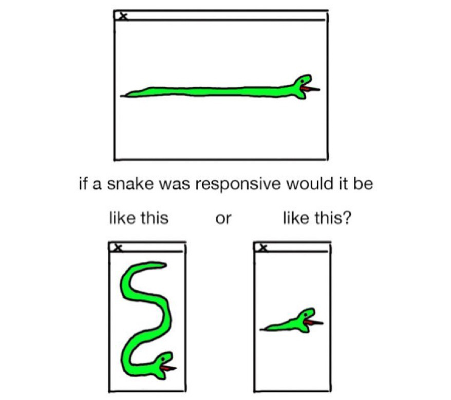

## Welcome to **Design for the Web 2**

_DES491 - Fall 2025_

Let's make some Web Sites!

---

## Today in Class

- Reviewing Homework
- Submit URLs for homework
- Mobile-first Design
- Introduce Project 1

---

# Let's Review the Homework

Any parts that were challenging? Let's go through them.

---

## It's time to collect homework!

Write your name and your site URL on a piece of paper and drop it in The Jar.


---

# What is responsive design?

---

# Responsive Design

Responsive design is the practice of designing and building websites that provide an optimized experience across a range of devices and screen sizes.

---



https://www.instagram.com/p/BOGFCQQBOcd/?hl=en

---

## Mobile-First Design

- What is it?
- Why is it important?
- How do we do it?

---

## What is Mobile-First Design?

In mobile-first design, we start by designing for the smallest screen size and then _progressively enhance_ the design for larger screens.

---

### Side note: Progressive Enhancement

Progressive enhancement is a web design strategy that focuses on building a basic & fully functional experience for all users, regardless of device capabilities, and then adding enhancements for users with more advanced browsers or devices.

> Every user may have a **different** experience on the site, but they will all have a **good** experience.

---

### Levels of enhancement:

1. Basic content and functionality (HTML)
2. Enhanced presentation (basic CSS)
3. Advanced presentation (modern CSS)
4. Advanced interactivity (JavaScript, HTML5 features)

No matter which level a user experiences, they will still be able to access the core content and functionality of the site.

---

### Example

- `` tag with alt text: even if images are disabled or fail to load, users can still understand the content through the alt text.

---

## Why is Mobile-First Design Important?

- Mobile devices are now the primary way many people access the web.
- Mobile-first design ensures that the most important content and functionality are prioritized for all users.
- It encourages simplicity and clarity in design.

---

## How do we do Mobile-First Design?

- Design mobile layouts first.
- Expand and enhance for larger screens.

---

Start with a simple, clean layout that works well on small screens.

- Prioritize content: make sure the order makes sense.
- Use a single-column layout
- Ensure that fonts are legible on small screens, but also not too large.

---

Duplicate this layout and resize it to a larger screen size.

The overall order of content should remain roughly the same top-to-bottom.

Things you can (but don't need to) do:

- Add more columns.
- Add more contrast in font sizes.
- Increase base font size slightly
- Add more padding and margins.

---

> Just because you have more screen width on desktop doesn't mean you need to fill it all up!

Blocks of long text should still be kept to a reasonable width for readability. (depends on the font size but generally 700-1000px)

A good general rule is to keep line lengths between 50-75 characters.

---

## Mobile-First Development

We can follow the same principles when building our sites.

1. Start with mobile layout (small screen size)
2. Use media queries to adjust layout for larger screens, adding extra container elements as needed.
3. Test on multiple screen sizes to ensure a good experience for all users.

---

## Media Queries

Media queries allow us to apply different CSS rules based on the characteristics of the device, such as screen width.

```css[1-12|1-5|6-12]
/* CSS rules that apply to all screen sizes */
.container {
  display: flex;
  flex-direction: column;
}

@media (min-width: 768px) {
  /* CSS rules for screens 768px and wider */
  .container {
    flex-direction: row;
  }
}
```

---
