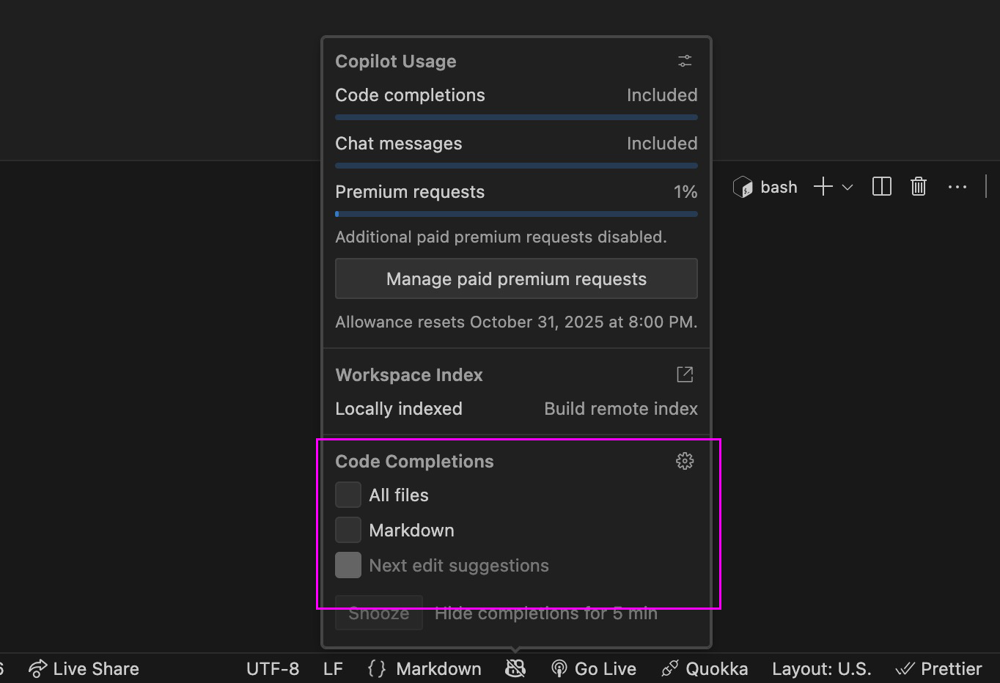
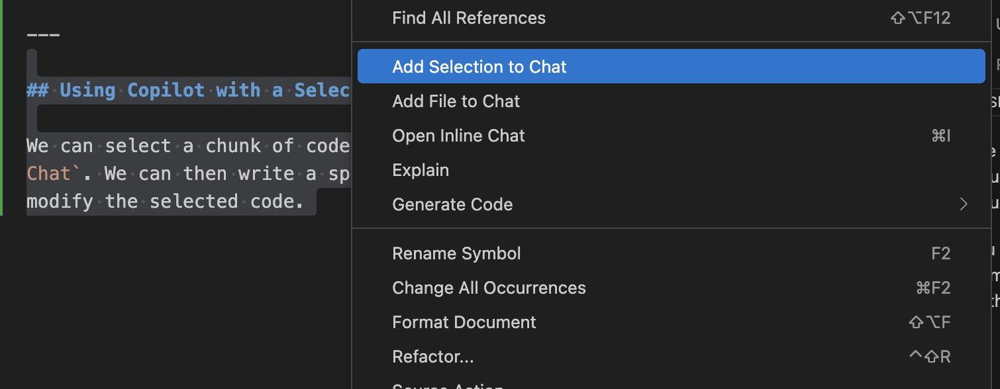

## Welcome to **Design for the Web 2**

_DES491 - Fall 2025_

Let's make some Web Sites!

---

## Today in Class

- Midterm check-in
- Developing with AI
- Finish Project 1

---

## Midterm Check-in

I made an anonymous survey to see how things are going so far. Please fill it out so I can plan for the rest of the semester!

---

## Developing with AI

AI can help you with your development work. While the standard Copilot 'auto-complete' function tends to get in the way, there are other, more structured ways you can interact with AI in the Codespaces/VS Code environment.

---

## Disabling Copilot Autocomplete

---

Make sure these two checkboxes are unchecked. You may have to apply this setting on each file type separately (e.g. HTML, CSS, JS, Astro, etc.)

---

## Manually using Autocomplete

If you want to ask Copilot to autocomplete the current line of code, you can press `Option` + `\` (or `Alt` + `\` on Windows.)
This will give you a suggestion, which you can accept by pressing `Tab` or reject by pressing `Escape`.

---

## Autocomplete Alternate Suggestions

Sometimes, Copilot will give us an option for multiple different suggestions. If you hover over the suggested code, you can switch between them.

---

## Copilot Chat

We have the ability to use Copilot in Codespaces with a chat interface, similar to how you've likely used ChatGPT, Gemini, Claude, etc. This lets us have more control over what the AI generates.

---

We can open Copilot Chat by clicking the little button at the top of the window, to the right of the search box.

---

## Using Copilot Chat

We can ask Copilot Chat to make specific changes to the code. In general, the _more specific_ our request is, the better the output will be.

You should treat Copilot as if you were making the changes yourself - make a change, then look at the site to see if it looks how you expected. If it doesn't look right, explain what is wrong with it and ask Copilot to fix it.

---

## Using Copilot with a Selection

We can select a chunk of code, right click it, and click `Add Selection to Chat`. We can then write a specific prompt to explain how the code works, or to modify the selected code.

---

## Add Selection to Chat

---

## Add Terminal Selection to Chat

We can also select something (like an error message) in the terminal, right click it, and click `Add Terminal Selection to Chat`. This will let us write a prompt to explain the terminal message.

---

## Adding Multiple Things to the Chat

We can add multiple things to the chat. Each of these items, considered to be _context,_ helps the AI know which parts of your project to focus on when generating a solution. You may sometimes need to add other files (such as components you're using), for the AI to be able to generate a good solution.

---

## AI Commit Messages

When you make a change to your code, you can use Copilot to generate a commit message for you. Click the sparkle icon in the commit message field for Copilot to analyze your changes and write a message. Sometimes these will be good, but sometimes they may be too generic.

---

## Work time!

Remember to fill out the mid-semester survey!