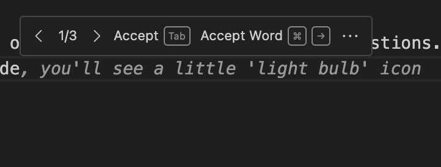
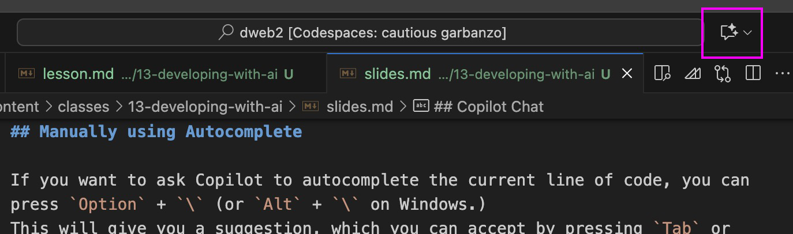

## Welcome to **Design for the Web 2**

_DES491 - Fall 2025_

Let's make some Web Sites!

---

## Today in Class

- Midterm check-in
- Downloading Components
- Finish Project 1

---

## Midterm Check-in

I made an anonymous survey to see how things are going so far. Please fill it out so I can plan for the rest of the semester!

---

## Developing with AI

AI can help you with your development work. While the standard Copilot 'auto-complete' function tends to get in the way, there are other, more structured ways you can interact with AI in the Codespaces/VS Code environment

---

## Disabling Copilot Autocomplete

---

Make sure these two checkboxes are unchecked. You may have to apply this setting on each file type separately (e.g. HTML, CSS, JS, Astro, etc.)

---

## Manually using Autocomplete

If you want to ask Copilot to autocomplete the current line of code, you can press `Option` + `\` (or `Alt` + `\` on Windows.)
This will give you a suggestion, which you can accept by pressing `Tab` or reject by pressing `Escape`.

---

## Autocomplete Alternate Suggestions

Sometimes, Copilot will give us an option for multiple different suggestions. If you hover over the suggested code, you can switch between them.

---

## Copilot Chat

We have the ability to use Copilot in Codespaces with a chat interface, similar to how you've likely used ChatGPT, Gemini, Claude, etc. This lets us have more control over what the AI generates.

---

We can open Copilot Chat by clicking the little button at the top of the window, to the right of the search box.
