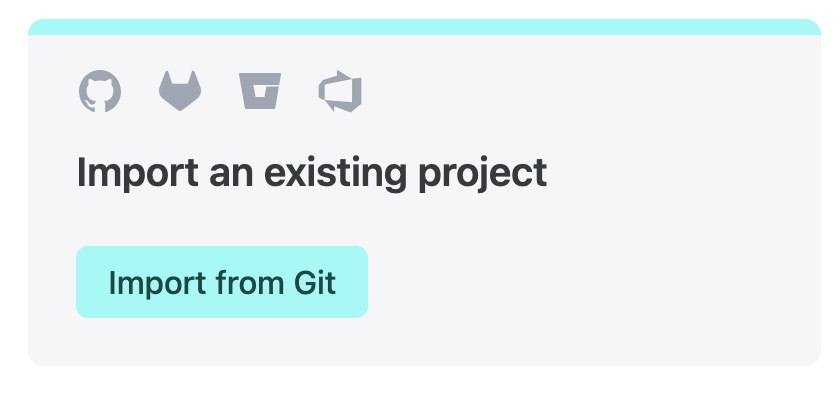
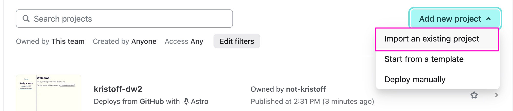
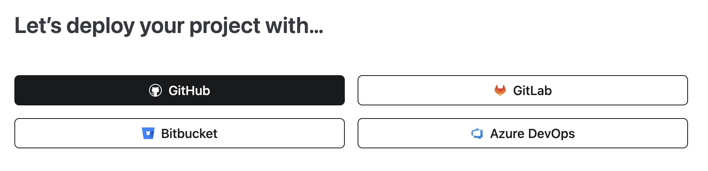
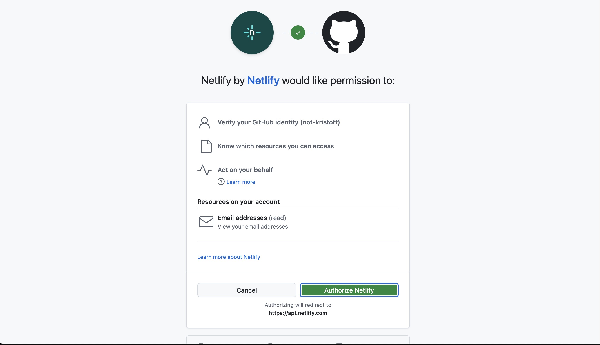
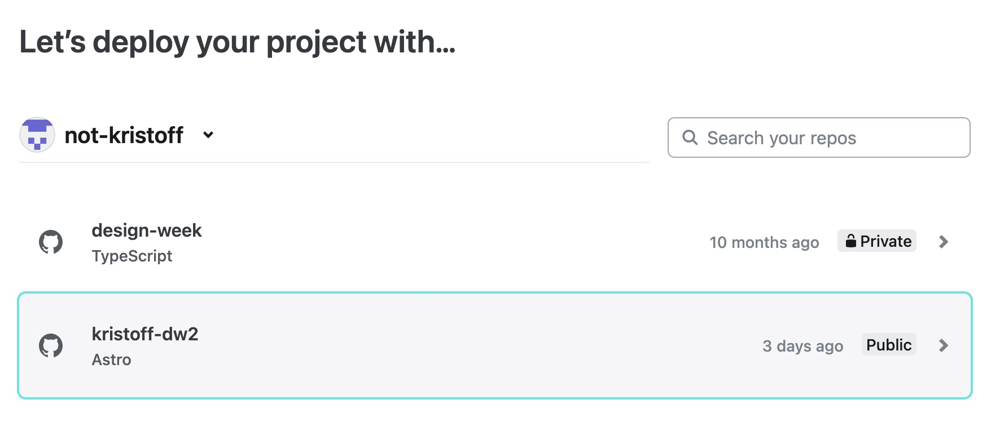
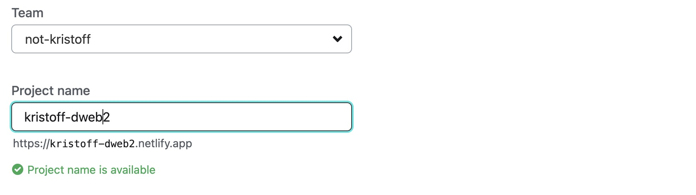

In this class, we'll be using a tool called Astro, that helps us build websites faster. We'll still be writing some code, but Astro will help us with some repetitive tasks, and will do things like optimize images and CSS.

A _build_ refers to the process by which Astro takes the code we write, and turns it into a finished website that we can publish online. We will need to set up a build process (which is what this tutorial is) to get our site online. Once this is set up, the site will automatically rebuild and publish itself whenever we make changes to the code.

For this to work, you will need the following:

- Your site code in a GitHub repository
- A Netlify account (which is free)

## Step 1: Sign into Netlify

Go to [Netlify](https://www.netlify.com/) and sign in.

If you have never used Netlify before, you will see a `Import an existing project` section. If you see this section, click the big green `Import from Git` button:

If you have used Netlify before, you will see a different screen, with your existing sites listed. In this case, click the `Add new project` button in the top-right corner, then select `Import an existing project` from the dropdown menu:

## Step 2: Connect to GitHub

Next, you will need to connect your GitHub account to Netlify. Click the `GitHub` button:

You will have to sign into GitHub and authorize Netlify to access your repositories. You may have to go through a few screens to complete this. You also may have to use a 2-factor authentication code (sad.)

When you see this screen, click the `Authorize Netlify` button:

## Step 3: Select your Repository

After authorizing, you should see a list of repositories. The most recently accessed ones should be at the top. Find yours in the list (you can use the search box if needed), and click it.

## Step 4: Configure your Settings

On the next screen, the only thing you need to change is the `Site name`. This will be the URL of your site on Netlify, so try to make it something unique and easy to remember (like `firstname-dw2` or something like that.)

Once you have chosen a name, you can scroll all the way to the bottom of the page and click the big green `Deploy` button.

## Step 5: Wait for the Build

You will now be taken to your project's dashboard in Netlify. If you click the `Deploys` tab on the left, you can see the progress of the _build_. This may take a minute or two, depending on how complex your site is.

Once if finishes deploying, the project URL will turn green, and you will see a `Published` label in the list of deploys. You can click the URL to open your site in a new tab!
