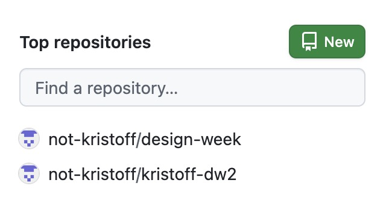
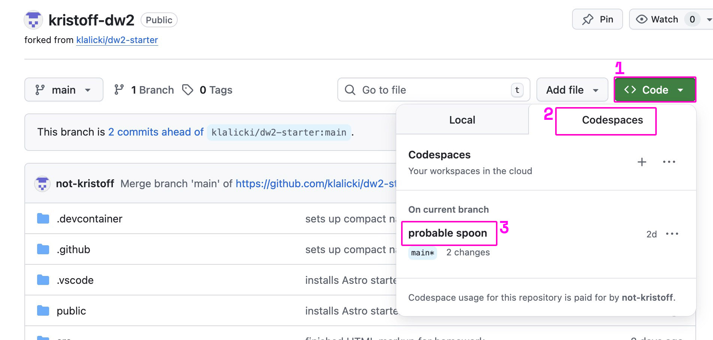
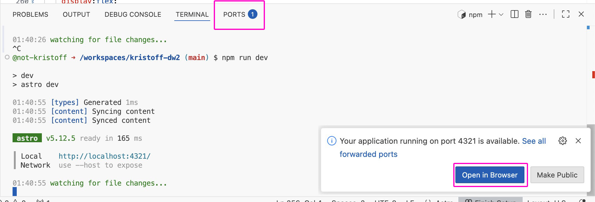
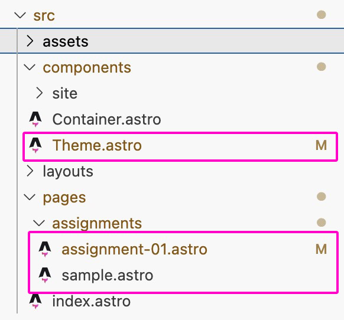

GitHub Codespaces is a cloud-based development environment that allows you to edit code in your browser, using an integrated version of Visual Studio Code. This means you can work on your Astro project from any computer, without having to set up a local development environment.

## Finding your Project on GitHub

First, find your project page on GitHub. It will probably be in the left panel of the homepage, under "Your repositories". If not, you can click on your profile picture in the top-right corner and select "Your repositories" from the dropdown menu.



## Opening a Codespace

On the repository page, first click the big green "Code" button, then select the "Codespaces" tab in the dropdown menu. If you have already created a codespace for this project, you can select it from the list. If not, click the `+` button (under the "Codespaces" tab label) to create a new codespace.



## In the Codespace

The first time you open a codespace, it may take a few minutes to set up. Once it's ready, you'll see a web-based version of Visual Studio Code. On the bottom of the window, you should see a terminal (command line). If it's not open already, click the 'Terminal' tab at the bottom of the window, or select 'Terminal' > 'New Terminal' from the top menu.

### The first time you open your Codespace

The first time you open your codespace, you will need to make sure the project software is correctly installed. In the terminal, type the following command and press Enter:

```bash
npm install
```

This will take a minute or two to complete. Once the installation completes, you will be able to start the development server.

### Starting the Development Server

This is similar to the 'Live Server' extension you may have used in Visual Studio Code or Codespaces for other projects. In the terminal, type the following command and press Enter:

```bash
npm run dev
```

This will start the development server. After a few moments, you should see a message in the terminal that says something like `Local.   http://localhost:4321`

A little window will pop up in the bottom-right corner of the Codespaces window, asking if you want to open the port. Click the "Open in Browser" button. If you miss this popup, you can also click into the "Ports" tab next to the "Terminal" tab at the bottom of the window, find the port number (probably 4321), and click the URL next to it in the "Fowarded Address" column.

Your site should now open in a new browser tab!



## Editing your Site

Now, let's look at how the project folder is structured. Open the file explorer (icon with two files, at the top of the left sidebar). You should see a list of files and folders.

We will mainly be working in the `src`->`pages`->`assignments` folder. Each page in this folder will become an assignment page on your website.



If you want to change the site colors/fonts, go to the `src`->`components`->`Theme.astro` file. This file has all the CSS variables that control the site appearance.

## Inside an `.astro` File

`.astro` files are a mix of HTML, CSS, and JavaScript (which we'll look at later). At the top of the file, you'll see a section enclosed in `---` lines. The only part of this section you need to worry about for now is the last line of that section, which will look like this:

```js
export const pageTitle = "Assignment 01";
```

This line sets the title of the page, which will appear in the browser tab and in the site navigation menu. Change the text inside the quotes to change the title.

Below that section, you'll see the HTML structure of the page. All of the page content is inside a `<Layout>` component. (This is an Astro component which we'll look at later, but for now, think of it as a special tag that provides the page layout and navigation menu.)

Below the `<Layout>` tag, you'll see a `<style>` tag. This is where you can add CSS to style the page. In Astro, we usually write CSS like this in a `<style>` tag inside the `.astro` file, rather than in a separate `.css` file.

Now, you can go ahead and make changes to the page. When you save the file (Ctrl+S or Cmd+S), the development server will automatically reload the page in your browser tab, so you can see your changes right away.

## Committing and Pushing Changes

When you're happy with your changes, you can commit them to your GitHub repository. Click the Source Control icon (the icon that looks like a branch) in the left sidebar. You should see a list of changed files. In the "Message" box at the top, type a brief description of your changes (for example, "Updated Assignment 01 title"). Then click the 'Commit' button.